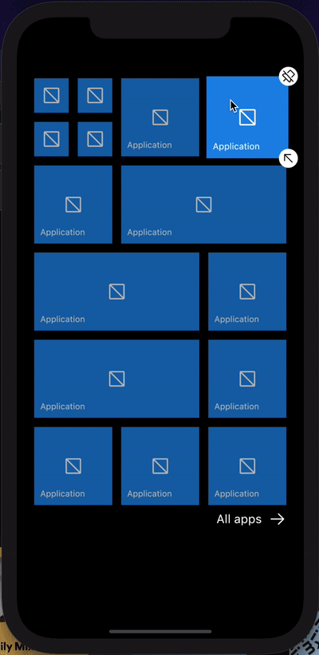

# Windows phone UI in flutter

A flutter based project, what can become a Launcher in the future

## Contains

- Windows like grid
- Application list
- Semantic zoom search
- packing algorithm to find an optimal arrangement for grid items

## TODO for working launcher

- pinch zoom to close and open Semantic zoom search
- scroll to position when letter from semantic zoom is selected
- disable navigation when semnatic zoom search is open
- handle tap on "All apps" under grid
- working search functionality
- resizing grid items
- moving grid items
- unpin grid item
- add grid item
- reset app list position after navigation to the grid
- refactoring (widget splitting)
- real app data source
- grid state storage
- app list context menu to pin items to the grid/uninstall
- pixel perfect changes